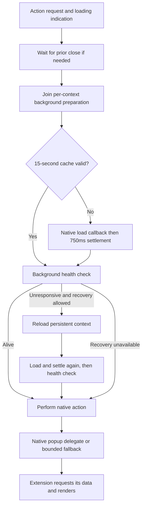

# Crest extension architecture and latency audit

Audited source: `457ac1d2c9bc78011e595664053f24df50ae2249`, September 7, 2026. The source review follows the repository guardrails: cohesive responsibilities and dependency boundaries matter; arbitrary file-size limits, unnecessary protocols, and feature-specific source-topology tests are not recommendations. Production source remains unchanged.

The extension layer has a sound browser-engine boundary and explicit compatibility contracts. Shared application behavior is substantial. The strongest next investments are reducing repeated main-actor work, consolidating background readiness, and separating portable runtime assembly from packaging. The user's popup/loading and intermittent Dark Reader page-delay symptoms focus the measurement plan; a common production cause has not been established.

The audit renewed one exact Firefox Dark Reader popup/restoration scenario and five warm-up tests: all six passed. This complements the broader first-pass 117 macOS tests documented in [validation evidence](validation.md). It establishes eventual behavior under the tested conditions; current test timing does not measure first-click responsiveness. Details and limits follow the architectural findings.

## Prioritized findings

### EXT-1 — High: eliminate full-session projection from each WebKit tab-property read

**Evidence:** [BrowserExtensionTabWindowCoordinator.swift:254](../../../CrestShared/Infrastructure/WebKit/BrowserExtensions/BrowserExtensionTabWindowCoordinator.swift#L254) recomputes `projectedState(for:)` whenever `currentState` is read while a browser is connected. `projectedState` at line 261 constructs a new `BrowserExtensionSessionState`; its initializer in [BrowserExtensionSessionState.swift:26](../../../CrestShared/Domain/BrowserExtensions/Models/BrowserExtensionSessionState.swift#L26) maps every Space and every tab and resolves live runtime activity for each. The coordinator's `state(for:in:context:)` at line 432 reads that projection to answer one tab. [BrowserExtensionTabAdapter.swift:35](../../../CrestShared/Infrastructure/WebKit/BrowserExtensions/BrowserExtensionTabAdapter.swift#L35), `:44`, `:62`, `:83`, and `:327` independently call it for index, title, URL, pinned, and selected metadata. Existing reconciliation already materializes `lastState` at coordinator lines 188–208, but these getters do not reuse it while connected.

**Implication:** a native enumeration of N tabs can do multiple O(total session tabs) projections per tab; this permits quadratic work during a `tabs.query`-style metadata enumeration and repeats page-provider lookups/allocations on the main actor. It also projects unrelated Spaces for a Space-scoped caller. This complexity follows from source; actual call counts, latency, and visible hitches are not measured.

**Scope:** make one owner maintain an indexed extension projection, updated once per session transaction and explicitly invalidated by live page activity, transient tab, and auxiliary window changes. An alternative smaller first change is a direct authorized per-tab read with live fields resolved only for that tab. Do not blindly return `lastState`: loading, reader mode, transient announcements, and event ordering are part of the contract.

**Validation:** profile a fixture extension enumerating native tab properties and `tabs.query` at 50, 200, and 1,000 tabs, including multiple Spaces; count projection/runtime-activity calls as well as elapsed time. Preserve the existing platform-conformance, tab identity, transient-tab announcement, tab-moving, and tab-group suites. Add behavior coverage only where a new cached projection could return stale data or emit out-of-order events.

### EXT-2 — High: prepared-package cache avoids publication work, but not launch preparation work

**Evidence:** `BrowserExtensionRuntimeContextController` is main-actor isolated ([BrowserExtensionRuntimeContextController.swift:145](../../../CrestShared/Infrastructure/BrowserExtensions/Controller/BrowserExtensionRuntimeContextController.swift#L145)); its `loadStoredPackage` synchronously invokes `storedResourcePreparer.prepare` at line 839 before the next `await`. The installation controller does likewise at [BrowserExtensionInstallationController.swift:77](../../../CrestShared/Infrastructure/BrowserExtensions/Controller/BrowserExtensionInstallationController.swift#L77). [BrowserChromeWebStoreCompatibilityPackagePreparer.swift:149](../../../CrestMac/Features/Extensions/Services/BrowserChromeWebStoreCompatibilityPackagePreparer.swift#L149) holds one static `NSLock`, then copies/expands the complete package at 159–165, generates/injects the runtime at 170, and hashes the prepared tree at 193. Only at 202 does it compare the existing digest. `preparedContentDigest` at 303 enumerates/sorts all paths and reads every regular file at 329. The runtime is inserted into every nonsandbox packaged HTML page and every isolated content-script declaration (`:703`, `:759`). `BrowserExtensionRestorationController.swift:44` restores enabled installations in sequence.

**Implication:** an unchanged extension still incurs copy/extract, rewrite, full-tree read, and temporary disk use on restore. Costs multiply with installations/Spaces and occur synchronously on the UI executor. The current stable resource URL and content-addressed generated runtime are correct and valuable; the cache is currently a publication cache, not an early preparation cache. This is a source-backed optimization candidate, not a measured startup regression.

**Scope:** first measure the stages; move archive/file/script generation to an explicitly isolated async preparation service returning immutable results, keeping WebKit context mutation on the main actor. Add a cache key from verified package identity/content digest, preparation/runtime version, permissions/manifest inputs, runtime identity, and clipboard/diagnostic inputs. For mutable unpacked resources, continue checking source changes with appropriate invalidation. Preserve stable published URLs, atomic replacement, migration handling, and retained old generated resources. A per-key task/cache owner can replace the broad blocking lock once concurrency is introduced.

**Validation:** compare cold and unchanged warm restore with 1/5/10 representative extensions and multiple Spaces; inspect main-thread wall time, bytes read/written, and temporary peak disk use. Existing package/restore tests should cover stable resource paths, generated-name invalidation, authored bytes untouched, and persistence across restart. Add cache invalidation behavior cases for changed package, runtime source, manifest/permissions, runtime identity, and injected capability token; do not assert internal file topology.

### EXT-3 — Medium: separate the browser-neutral runtime from package preparation

**Evidence:** [BrowserChromeWebStoreCompatibilityPackagePreparer.swift](../../../CrestMac/Features/Extensions/Services/BrowserChromeWebStoreCompatibilityPackagePreparer.swift) is 7,481 lines. The same file owns manifest compatibility/error policy (`:5`), archive staging/cache/publication (`:112`), manifest/page/script rewriting (`:366`), and a generated JavaScript runtime factory (`:937`, literal starts `:1110`) covering namespace facades, errors, diagnostics, runtime messaging, context menus, alarms, storage, and more. Namespace-specific fragments already exist and are spliced at `:4892` and `:5015`, showing a usable decomposition direction. Pure format normalization and API behavior are located in a macOS feature-services owner alongside platform packaging.

**Implication:** a storage/messaging change shares its edit surface with archive preparation and every other compatibility concern. This makes reasoning, review, isolated execution, and future reuse harder. Splitting filenames alone would preserve the same coupling: current fragments depend on helpers and state in the outer generated lexical scope. The same full bundle is placed into background, extension pages, and isolated content worlds, which is also a parse/startup measurement candidate; source alone does not establish that bundle size is currently a bottleneck.

**Scope:** use three cohesive seams: package preparation/publication, manifest/context normalization, and a deterministic runtime assembler with named API modules and an explicit shared transport/error/context interface. Put portable runtime assembly/policies in shared Infrastructure/Domain as appropriate, retaining store acquisition, native hosts, and platform presentation under Mac. Keep one ordered generated script if WebKit requires it; no new JS framework or plugin registry is necessary. Process-specific emitted bundles should follow measurement and preserve content-script/programmatic-injection parity.

**Validation:** use existing prepared-package, module/classic worker, MV2 background, MAIN/isolated-world, namespace identity, callback/Promise, storage, and messaging fixtures. Native WebKit tests are needed alongside fragment execution because exotic namespace identity/receivers cannot be represented faithfully by plain JavaScript mocks. This recommendation does not imply enabling extensions on mobile.

## Strengths to retain

- **One explicit routing contract.** [BrowserExtensionAPICompatibilityMatrix.swift:92](../../../CrestShared/Domain/BrowserExtensions/Policies/BrowserExtensionAPICompatibilityMatrix.swift#L92) pins schema/engine revisions and models namespace/member route, process exposure, permissions, native hiding, and presence-only members. Package generation serializes these properties (`BrowserChromeWebStoreCompatibilityPackagePreparer.swift:960` onward); loaded contexts apply current matrix hiding rather than replaying stale persisted routes (`BrowserExtensionRuntimeContextController.swift:524`). [BrowserExtensionAPICompatibilityMatrixDocumentationTests.swift:47](../../../CrestTests/BrowserExtensionAPICompatibilityMatrixDocumentationTests.swift#L47) compares both developer and Help Center generated blocks against that matrix. This is a real single-source-of-truth strength.
- **Shared behavior with platform edges.** [BrowserExtensionTabGroupStore.swift:4](../../../CrestShared/Application/BrowserExtensionServices/TabGroups/BrowserExtensionTabGroupStore.swift#L4) makes BrowserSession the exclusive folder/group source, translating extension operations into the same filing and grouping behavior (`:64`, `:69`), with stable extension IDs as a projection. Sidebar/DNR/cookie/notification policies and stores have similarly framework-neutral owners. Keep this pattern for new emulated capabilities.
- **Native identity and honest limits.** The runtime preserves native namespace/event identity where possible and explicitly distinguishes native, patched, emulated, presence-only, and unavailable. Missing `webRequest` enforcement and unimplemented namespaces are documented engine/product boundaries, not clean-code defects. Do not count namespace presence as full behavior support or attempt to achieve network enforcement with another shim.
- **Permission and Space identity are resolved at the host boundary.** Native context/loaded controller ownership determines clients, and request DTOs validate browser-independent inputs. Runtime registration separates verified store identity for external native messaging from internal capability-broker authorization (`BrowserExtensionRuntimeContextController.swift:556` onward). This makes the conceptual mapping defensible.
- **Meaningful tests beyond strings and mocks.** Script suites validate Promise/callback semantics, stale tab identity, event listener removal, and permissions; native namespace tests load a prepared module worker in WebKit ([BrowserExtensionNativeNamespaceTests.swift:8](../../../CrestTests/BrowserExtensionNativeNamespaceTests.swift#L8)), platform conformance pins Objective-C selectors that can otherwise silently mismatch (`BrowserExtensionPlatformConformanceTests.swift:73`), and startup tests exercise composition order through the page pool (`BrowserExtensionStartupPipelineTests.swift:22`).
- **Bounded work and diagnostics already exist.** The common `capabilityWatch` (`BrowserChromeWebStoreCompatibilityPackagePreparer.swift:4325`) centralizes reconnect backoff/failure limits and does not connect without listeners; console capture is opt-in (`:91`). Preserve these rather than introducing new periodic polling.

## Mapping and evidence boundaries

| Surface | Current ownership/readiness | Audit judgment |
| --- | --- | --- |
| Native WebExtension engine and supported APIs | WebKit, with explicit host adapters and matrix-selected patches | Correct primary boundary; preserve native object identity and engine security contracts |
| Chrome/Firefox package formats | Separate acquisition/provenance; common prepared runtime | Good consolidation; package/runtime implementation owner now needs decomposition |
| Space, tab, folder/group semantics | Shared session and typed policies; WebKit adaptation in shared Infrastructure | Correct conceptual mapping; repeated projections are the scaling issue |
| macOS host presentation/native companion | Mac infrastructure/shells | Correct platform seam |
| Mobile extensions | Explicitly disabled, even though shared implementation is compiled | Not delivered by shared-code placement alone; [BrowserPlatformSafariWebExtensionLoader.swift:1](../../../CrestMobile/Infrastructure/WebKit/Extensions/Controller/BrowserPlatformSafariWebExtensionLoader.swift#L1) and the mobile delegate comments explicitly reserve this for a product decision |
| Compatibility certification | Behavioral fixtures plus dated/manual external-package evidence | Strong base, but matrix/documentation tests certify routing intent, not end-to-end parity |

[ExtensionCompatibility.md:1015](../../../Documentation/ExtensionCompatibility.md#L1015) explicitly dates the popular-extension audit to August 16, 2026 and distinguishes startup from complete workflows. Its repeatable signed-package audits at 1284 are opt-in and use current external packages. [ExtensionAPICompatibilityMatrix.md:491](../../../Documentation/ExtensionAPICompatibilityMatrix.md#L491) outlines cold launch, popup, auth, messaging, page integration, idle CPU, and relaunch acceptance. Treat those as an acceptance plan and historical evidence. The exact Firefox package scenario below was renewed on the audit toolchain; real-account workflows, other packages, forced worker termination, and broad release certification were not.

The handwritten architecture narrative deserves a small refresh alongside these refactors. [ExtensionEmulationServices.md:27](../../../Documentation/ExtensionEmulationServices.md#L27) says notifications are the only framework-neutral app-side service, although its own lines 337–352 enumerate several more. Lines 34–36 say the prepared runtime copy is discarded with its context, while the actual cache preserves stable paths and uses `removesRootOnDeinit: false` (`BrowserChromeWebStoreCompatibilityPackagePreparer.swift:227`). The generated routing tables are guarded; these historical prose statements are not. This is proven documentation drift, not a runtime compatibility failure.

## Popup latency and background readiness

The package copied read-only for this audit is **Firefox Dark Reader 4.9.129**, extension ID `addon@darkreader.org`, manifest V2 with `background.page = background/index.html`. It is not an MV3 worker. The 856,583-byte archive matched its recorded acquisition SHA-256, `f4f047fe08e420b6d29617738ea00a7b784892b2262b7e6f38dd09b8ee958a44`. This pins the tested package without modifying its source or the installed profile; it is not a new Mozilla signature certification. A Chrome package and an MV2 Firefox package must be measured separately before attributing symptoms to worker eviction.

Distinguish three milestones: Crest's toolbar loading indication, WebKit's popup presentation, and the extension's meaningful content. For ordinary browsing, distinguish navigation start/commit/finish, first paint, and completed theming. A delayed dark theme does not by itself prove a blocked network request.



The recovery-unavailable path still performs the action after reporting the outcome. That preserves a chance for WebKit to present/recover; it does not mean the background was declared healthy.

| Stage | Executable schedule | Meaning for latency |
| --- | --- | --- |
| Startup | [Root preparation](../../../CrestMac/Features/Browser/BrowserRootView/Models/BrowserRootModel.swift#L89) awaits restore and content blocking before marking restoration complete. [Restoration](../../../CrestShared/Infrastructure/BrowserExtensions/Controller/BrowserExtensionRestorationController.swift#L44) loads installations sequentially and then awaits background tasks | Background warm-ups can overlap. Do not multiply 750ms by the extension count as a claimed serial sleep. Package preparation still performs synchronous work |
| Previous popup close | [Popup toggle](../../../CrestMac/Infrastructure/WebKit/BrowserExtensions/BrowserExtensionPopupToggle.swift#L122) waits for native close; a missed notification has a 1-second fallback | Applies to an outstanding close, especially rapid reopen |
| Native background load | [Warm-up primitive](../../../CrestShared/Infrastructure/BrowserExtensions/Controller/BrowserExtensionRuntimeContextController.swift#L25) uses a 3-second missing-callback deadline and 750ms settlement after a successful callback | Every context with background content receives the settlement delay when this primitive is used, even after an immediate native callback. The 3-second deadline is not an end-to-end deadline once a callback has arrived |
| Popup preparation/cache | [Popup delegate](../../../CrestMac/Infrastructure/WebKit/BrowserExtensions/BrowserExtensionTabWindowCoordinator+WKWebExtensionControllerDelegate.swift#L172) coalesces concurrent callers by context and retains successful readiness for 15 seconds | Cache hit skips native load/settlement, but still verifies health. Hover and click can join the same request |
| Health check | [Health service](../../../CrestMac/Infrastructure/WebKit/BrowserExtensions/BrowserExtensionBackgroundHealth.swift#L41) sends a nonce and waits up to 3 seconds | Missing endpoint fails immediately; an existing unresponsive endpoint consumes the timeout. This proves transport liveness, not vendor application initialization |
| Recovery | [Verification/recovery](../../../CrestMac/Infrastructure/WebKit/BrowserExtensions/BrowserExtensionTabWindowCoordinator+WKWebExtensionControllerDelegate.swift#L211) may unload/load the same persistent context, warm again, and ping again | Only a real action authorizes recovery; hover alone cannot. Several bounded waits can accumulate. Ephemeral controllers cannot exercise this recovery |
| Native presentation | [Action request](../../../CrestMac/Infrastructure/WebKit/BrowserExtensions/BrowserExtensionPopupBackgroundWarmUp.swift#L50) dispatches after preparation; a missing delegate handoff gets a 3-second presentation fallback | Reading the popup early can preload its document, so directly showing it before background preparation is not an equivalent optimization |
| Interactive-surface maintenance | [Activity lease](../../../CrestMac/Infrastructure/WebKit/BrowserExtensions/BrowserExtensionPopupBackgroundWarmUp.swift#L80) refreshes nonpersistent backgrounds every 15 seconds while its owner is active; visible-popup identity checks run every 250ms in [PopupToggle](../../../CrestMac/Infrastructure/WebKit/BrowserExtensions/BrowserExtensionPopupToggle.swift#L99) | These have different purposes. Hosted extension pages currently own individual leases; record active lease counts before consolidating them |
| Broker watch reconnect | [Shared watch implementation](../../../CrestMac/Features/Extensions/Services/BrowserChromeWebStoreCompatibilityPackagePreparer.swift#L4330) delays retries by 1/2/4/8/16 seconds and abandons at the sixth consecutive failure | Separate from native runtime-message delivery. A delivered message resets the budget; attribute delay only when a trace shows this path |

The installed Xcode 27 SDK's `WKWebExtensionContext.h` documents `loadBackgroundContent` as an if-needed load with an immediate callback when background content is already loaded. It does not promise that the extension's asynchronous settings/configuration work is finished. Controller load/unload applies to the full context. Historical stopped-worker/lingering-page evidence explains the defensive design, but it is not a reproduction of the present symptom.

### Competing explanations to test

1. **Repeated host preparation.** [Startup/install warm-up](../../../CrestShared/Infrastructure/BrowserExtensions/Controller/BrowserExtensionRuntimeContextController.swift#L305) bypasses the popup coordinator's readiness cache and observer collection. A click soon after restore can pay another settlement. Measure callback-to-settlement time, cache age, and overlap before consolidating. Do not delete the grace blindly: the [no-popup action fixture](../../../CrestTests/BrowserExtensionControllerPoolTests.swift#L730) deliberately registers its listener after 200ms.
2. **Healthy transport, busy extension.** The [health responder](../../../CrestMac/Features/Extensions/Services/BrowserChromeWebStoreCompatibilityPackagePreparer.swift#L4466) is installed in the generic prelude before package startup. The pinned Firefox package's `background/index.js:6481` awaits settings/state and parallel news, commands, active-tab, file-access and highlights work for its popup reply; its content-script connection also awaits data at line 6553. This permits both surfaces to wait after a successful health check. It does not identify which operation is slow in the user's session.
3. **Extra tab metadata dependencies.** [Membership refresh](../../../CrestMac/Features/Extensions/Services/BrowserExtensionTabGroupsCompatibilityScript.swift#L64) precedes each nonconcurrent patched `tabs.get/query`; concurrent calls share one refresh. The bridge adds a broker round trip and initially a native window lookup, followed by EXT-1's repeated projection. [Capability requests](../../../CrestMac/Features/Extensions/Services/BrowserChromeWebStoreCompatibilityPackagePreparer.swift#L4184) preserve pending native Promises. Measure the original broker/native requests separately before introducing revision-based caching. Returning fabricated empty results would change compatibility.
4. **A dead background or lifecycle churn.** A stale health endpoint can consume 3 seconds before persistent-context recovery. Correlate actual page/worker lifecycle, endpoint and action identities, context generation, and package shape. The passing Firefox idle test below does not prove an MV3 worker was evicted or that this recovery branch ran.
5. **Page content and theme progress diverge.** [Ordinary navigation](../../../CrestMac/Infrastructure/WebKit/BrowserPage+WKNavigationDelegate.swift#L55) does not invoke popup recovery before allowing a normal page; [page loads](../../../CrestMac/Infrastructure/WebKit/BrowserPage.swift#L532) go to WebKit. The pinned package sends a document-connect message from `inject/index.js:10125`, applies dynamic theming on a later background message at line 10076, and tracks pending stylesheet work at line 8996. Measure local-page navigation, paint, message response and theme completion separately, including extension-disabled controls.

### Current tests conceal the first-click delay

**The live helper reports readiness only after an unmeasured initial wait.** It [performs the action](../../../CrestTests/BrowserExtensionActionPopupLiveTests.swift#L895), sleeps 4 seconds, and starts its readiness timer [afterward](../../../CrestTests/BrowserExtensionActionPopupLiveTests.swift#L935). A near-zero ready value can therefore follow four seconds of visible delay. Its host-call probe issues fresh queries after that wait; it does not trace the original popup request.

The Chrome [post-eviction test](../../../CrestTests/BrowserExtensionActionPopupLiveTests.swift#L187) also inherits `warmsPopupBeforeMeasurement = true` and ephemeral storage from [helper defaults](../../../CrestTests/BrowserExtensionActionPopupLiveTests.swift#L702). After the 45-second idle, the helper makes two preliminary action calls before its measured open. Despite its comment, this does not test an untouched first action after eviction, and ephemeral storage excludes persistent recovery. The Firefox test explicitly disables prewarming and uses persistent storage; it is the better current eventual-readiness baseline, while retaining the timing limitation.

Historical documentation claiming no second recovery mechanism ships and describing a 1.5-second deadline is obsolete: current verification at the source links above reloads eligible persistent contexts and uses the schedule in this table. Treat [the worker report](../../../Documentation/WebKitExtensionWorkerReport.md) as dated investigation, not the current implementation contract.

## Renewed compatibility validation

On September 7, 2026, the unchanged audited revision was built/tested with Xcode 27.0 beta `27A5252f` in an isolated macOS Debug test host. The fixture copied the exact Firefox package identified above; it did not fetch a newer package or perform account/companion flows. The test visited `example.com`, so this was package-local rather than a wholly offline browser run.

| Selection | Result | What it establishes |
| --- | --- | --- |
| `BrowserExtensionActionPopupLiveTests/testLiveFirefoxDarkReaderPopupCompletesAcrossPersistentRestoration` | Passed, **56.110 seconds** | Fresh presentation and restored persistent-context presentation after a deliberate 45-second idle eventually rendered; assertions found no stalled follow-up host probe |
| `BrowserExtensionPopupBackgroundWarmUpTests` | **5 passed**, 0 failures | Loaded, failed, timeout, missing-context, and completion-race behavior of the existing primitive |
| Combined selection | **6 tests passed**, 0 failures; `TEST SUCCEEDED` | Focused compatibility baseline, separate from the earlier broader 117-test macOS selection |

The total test duration contains deliberate idle and helper waits; it is not popup latency. The log records background-ready outcomes, not a first-click timing trace. A runtime main-thread performance diagnostic also appeared without an attributed source call stack; it is a reason to profile, not proof that EXT-2 caused a measured stall. WebKit/process diagnostics did not fail the assertions. This is not a warning-free or full release-certification claim.

The executed command used a task-owned fixture and isolated stores:

```sh
CREST_ISOLATED_SESSION=1 \
TEST_RUNNER_CREST_RUN_CHROME_STORE_INTEGRATION=1 \
TEST_RUNNER_CREST_FIREFOX_PACKAGE_FIXTURE=/private/tmp/crest-audit-firefox-package-fixture-20260907 \
xcodebuild test -project Crest.xcodeproj -scheme Crest -configuration Debug \
  -destination 'platform=macOS,arch=arm64' \
  -derivedDataPath /private/tmp/crest-final-audit-20260907/TestData \
  -resultBundlePath /private/tmp/crest-final-audit-20260907/extension-baseline.xcresult \
  -parallel-testing-enabled NO \
  -only-testing:CrestTests/BrowserExtensionPopupBackgroundWarmUpTests \
  -only-testing:CrestTests/BrowserExtensionActionPopupLiveTests/testLiveFirefoxDarkReaderPopupCompletesAcrossPersistentRestoration \
  CODE_SIGNING_ALLOWED=NO
```

For reproduction, supply a fresh fixture directory containing `darkreader/installation.json` and the matching `darkreader/package.xpi`; validate its digest before use. The test process reads the unprefixed integration/fixture variables, forwarded by `TEST_RUNNER_`. Require a non-skipped result. Compact evidence is in the audit's [validation record](validation.md); large logs/result bundles remain task artifacts outside the repository.

## Implementation direction

| Work item | Concrete change and boundary | Acceptance |
| --- | --- | --- |
| **Measure the original interaction** | Start a monotonic trace immediately before the first action; join preparation, health, recovery, native presentation, original runtime/API request and meaningful-content milestones. Remove prewarming/fixed sleeps from the timing scenario while keeping eventual-readiness coverage | Fresh, warm, cache-expired, idle and recovery results report the same click-to-content interval. Trace does not preload the popup or expose message bodies, credential-bearing URLs or storage |
| **Consolidate context readiness** | One per-context owner lets startup, hover and action callers join work, records generation and recovery authority, and distinguishes transport liveness from extension initialization. Retain grace until a replacement preserves delayed-listener behavior | At most one preparation/recovery per generation under concurrent callers; no stale completion, duplicate action, lost first message or unauthorized hover reload; measured redundant waits decrease |
| **Make restore and metadata reads cheap** | Implement EXT-2's off-main early preparation cache and EXT-1's direct/indexed reads as independent changes. Tie membership cache validity to revision/Space changes | Unchanged restore skips avoidable I/O, queries scale with returned data, and context/storage/metadata invariants remain correct |
| **Separate runtime assembly** | Apply EXT-3 after the trace and behavior coverage are established. Move coherent responsibilities rather than merely splitting the giant literal | Native namespace identity, order, callback/Promise and execution-world contracts remain stable across package/background shapes |
| **Address an engine gap only after reproduction** | If the shipping background/storage shape exhibits actual liveness failure, make recovery explicit and on demand; preserve context identity, storage, events, ports and page state | The failing first action/navigation recovers without vendor source patches, fabricated success, permanent worker keepalive or forced reload of a page where someone is typing |

The regression set for these changes should include:

| Axis | Preserve and exercise |
| --- | --- |
| Background/lifetime | MV2 page, MV3 classic/module worker, no background, persistent versus ephemeral controller, observed termination versus mere elapsed idle |
| Input/popup | Hover, joining click, no-popup action once, keyboard/accessibility, rapid close/reopen, native delegate ordering, late fallback, runtime-replaced action |
| API/messaging | Native roots/events, listener removal, callback/Promise replies, `lastError`, top-frame targeting, pending storage promises, current group/tab identity |
| Recovery/state | Persistent storage, actual installed-event counts, native ports, sidebars/offscreen pages, content scripts, Space boundaries and cleanup |
| Page/long session | First navigation and paint, completed theme, iframe/Peek identity, ordinary and limited-permission origins, idle CPU, app plus WebKit memory, active lease/watch counts |

Existing additional focused suites include `BrowserExtensionBackgroundHealthTests`, `BrowserExtensionPopupToggleTests`, tab identity/platform conformance tests, and `BrowserExtensionControllerPoolTests/testToolbarWithoutPopupWaitsForBackgroundAndCoalescesPendingClicks`. They were inspected for this follow-up, not all rerun in the six-test selection. The opt-in `BrowserExtensionBackgroundWakeExperimentTests` and `BrowserExtensionBackgroundRestartMeasurementTests` accept forwarded `CREST_RUN_BACKGROUND_WAKE_EXPERIMENT=1` and `CREST_WAKE_PERSISTENT_STORE=1` for deliberate lifecycle experiments; their results must not justify fabricated tab events or unconditional reloads.

Preserve the exact tested extension behavior while changing ownership and cost. Set latency budgets from comparable optimized measurements, not from the current masked test timing. Refresh the living architecture prose alongside each focused implementation change.
