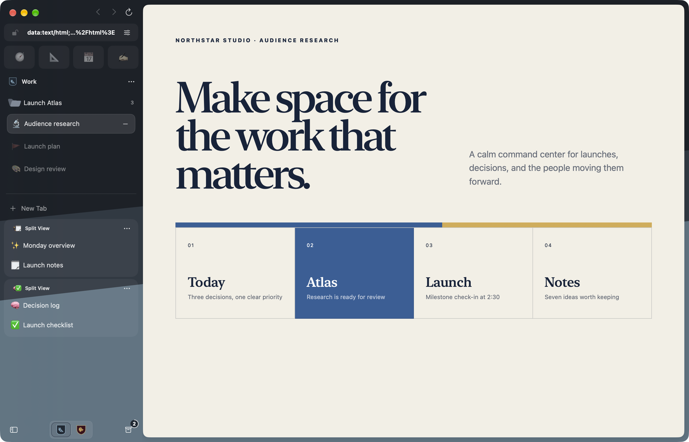
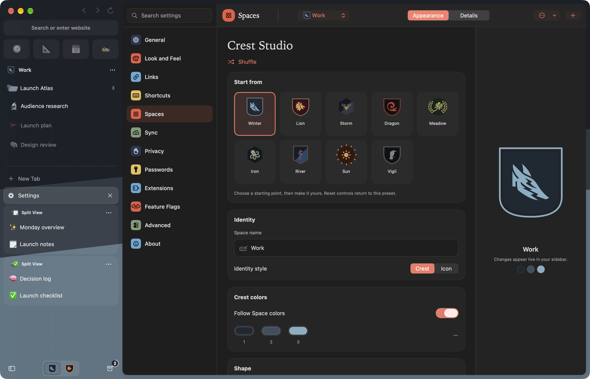
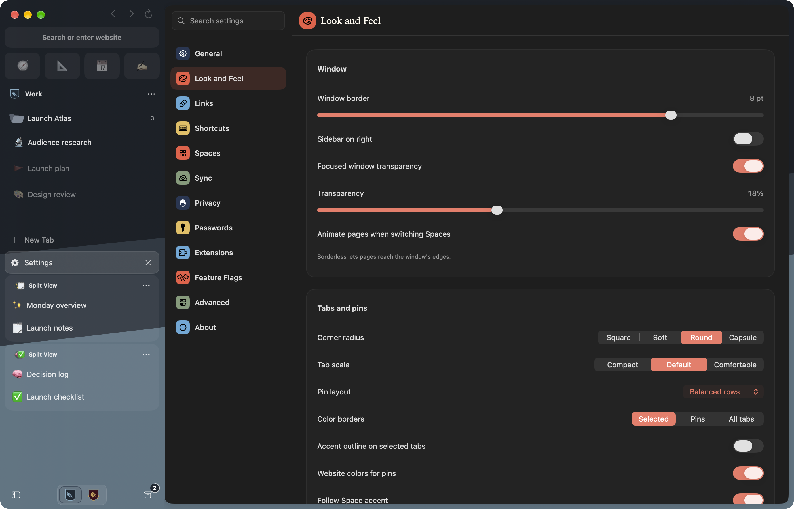
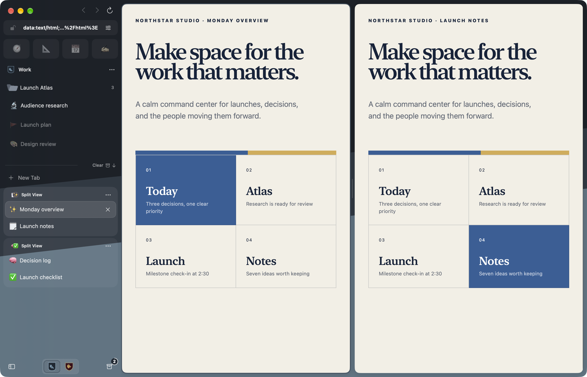
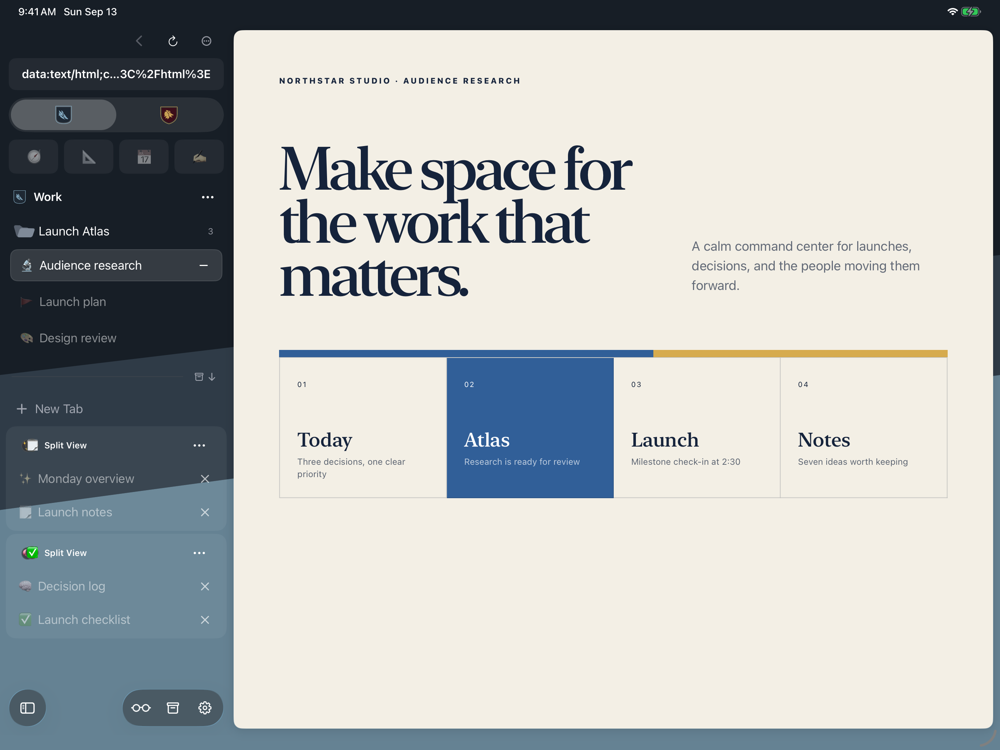
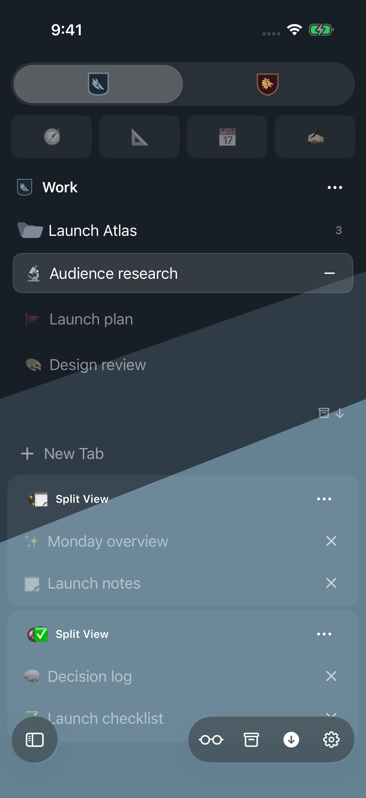

<div align="center">
  
  <h1>Crest</h1>
  <p><strong>An open source browser for Mac, iPhone, and iPad.</strong></p>
  <p>Built with SwiftUI and WebKit, with separate Spaces for different parts of your life.</p>
  <p>
    <a href="https://github.com/pauljoda/Crest/actions/workflows/ci.yml"></a>
    <a href="https://github.com/pauljoda/Crest/releases/latest"></a>
    <a href="LICENSE"></a>
  </p>
  <p>
    <a href="https://crestbrowser.com/"><strong>Visit the product site</strong></a>
    ·
    <a href="https://crestbrowser.com/guides/">Read the guides</a>
    ·
    <a href="https://github.com/pauljoda/Crest/releases/latest">Download for Mac</a>
    ·
    <a href="https://github.com/users/pauljoda/projects/3">Roadmap</a>
    ·
    <a href="https://www.reddit.com/r/CrestBrowser">Community</a>
  </p>
</div>

Browse Mac releases by channel: [Stable](https://github.com/pauljoda/Crest/releases?q=prerelease%3Afalse),
[Nightly](https://github.com/pauljoda/Crest/releases?q=prerelease%3Atrue+%22Nightly+builds%22), or
[Development](https://github.com/pauljoda/Crest/releases?q=prerelease%3Atrue+%22Development+builds%22).

<p align="center">
  <a href="Website/assets/crest-work-mac.png"></a>
</p>

## A browser with boundaries

Most browsers put every login, tab, and distraction into one long-lived container. Crest begins with **Spaces** instead. Give work, home, research, or a private session its own banner; Crest gives each one its own cookies, website data, history, archive, tabs, credentials, settings, and sync identity.

Switching Spaces changes more than the color of the window. It changes the browsing context.

## Crest Studio and Look and Feel

**Crest Studio** starts with templates and opens up into heraldic artwork, shapes, patterns, independent colors, emoji, monograms, and a searchable SF Symbols picker. Design a banner for each Space, or choose a quieter gradient.

**Look and Feel** lets you dock the sidebar on either edge, go borderless, adjust tab shape and scale, choose a pin layout, and tune tab and address-field colors. Start with a preset, see changes live, and reset individual settings. Choose an app icon palette, folder colors and icons, and a default page zoom from 25% to 500%.

<p align="center">
  <a href="Website/assets/crest-studio-mac.png"></a>
  <a href="Website/assets/crest-look-and-feel-mac.png"></a>
</p>

## Browsing features

- **A sidebar with structure.** Pins for everyday sites, saved tabs with a home URL, nested folders for projects, and current tabs for what you are doing now. Select tabs, Split Views, and folders together to organize them in one step.
- **Split View.** Keep two to four live pages in a group. Resize columns on Mac and iPad; move through focused cards on iPhone.
- **Peek.** Preview a link above the current page, then close it or keep it as a tab. On Mac, drag a link into a live Peek. On iPhone and iPad, native link and image menus keep touch actions close by.
- **Quick Window on Mac.** Open a link from another app using the right Space’s signed-in session. Promote it to a regular tab when it deserves to stay. Link Routing sends matching external links to their chosen Space.
- **Shared windows on Mac.** Open another window onto the same Spaces and tabs, with its own selection. Use a disposable Blank Window for temporary tabs with your Space’s signed-in session, or create one by dragging a tab outside the window.
- **Search and commands.** Open a URL, search the web, find tabs and history in your Space, or run a command from one field. Choose custom search engines and optional suggestions. Mac shortcuts can be rebound.
- **Getting Started.** Learn tabs, pins, and folders in an interactive browser tab, with Split View practice and extension guidance on Mac.



## Page tools

| Capability | What it does |
| --- | --- |
| On-device translation | Detect a page’s language, translate into a supported language, or show the original. Optional automatic translation uses downloaded languages. Apple may ask to download additional languages. |
| Reader and page tools | Read supported articles with fewer distractions, find text, adjust zoom, share links, copy Markdown links, print, and export PDF or web archives where supported. |
| Extensions on Mac | Install compatible Chrome Web Store, Firefox Add-ons, or Safari Web Extensions. Use popups, tab-specific side panels, and Firefox sidebars within the owning Space. [Compatibility varies.](https://crestbrowser.com/guides/extension-compatibility/) |
| Developer tools on Mac | Preview phone, desktop, and custom viewport sizes; capture pages; open Console, Network, and Web Inspector. The toolbar appears on localhost, or on any site with **Shift-Command-I**. |
| Media | Control eligible active media from the sidebar. On Mac, keep supported videos visible with Picture in Picture, including optional automatic PiP. |
| Downloads and uploads | Follow download progress and revisit files in Downloads. On iPhone and iPad, upload through Photos, camera, or Files. |

## Privacy and sync

**Private Spaces** use temporary website storage and stay out of normal history, restoration, and sync. They can require device authentication and relock when Crest leaves the foreground. **Crest Passwords** keeps origin- and Space-matched credentials in the system Keychain, with authentication for sensitive access.

Content blocking and site permissions are controlled per Space. Closed and cleaned-up tabs go to a recoverable Archive, subject to your retention settings. **Keep Loaded** protects a page from ordinary unloading when its live state matters.

Optional **iCloud sync** carries durable Spaces, tabs, folders, Split View groups, appearance, history, and Archive between devices. Password values stay out of CloudKit; eligible passwords can use iCloud Keychain separately. Start a browser import on Mac, review each destination Space, or export a portable Crest archive.

Read the [privacy policy](https://crestbrowser.com/privacy/), [Space isolation guide](https://crestbrowser.com/guides/spaces-and-isolation/), and [sync guide](https://crestbrowser.com/guides/sync-across-devices/) for the boundaries and controls.

## Get Crest

The same Spaces, shaped for each screen. iPad keeps the sidebar beside your page; iPhone gives your tabs and folders their own view.

<p align="center">
  <a href="Website/assets/crest-work-ipad.png"></a>
  <a href="Website/assets/crest-work-iphone-sidebar.png"></a>
</p>

| Platform | Install |
| --- | --- |
| Mac · Apple silicon · macOS 26.1+ | [Signed, notarized download](https://github.com/pauljoda/Crest/releases/latest) with built-in Sparkle updates. |
| iPhone · iOS 26.1+ | [App Store](https://apps.apple.com/us/app/crest-browser/id6797335023) |
| iPad · iPadOS 26.1+ | [App Store](https://apps.apple.com/us/app/crest-browser/id6797335023) |
| iPhone & iPad beta | [TestFlight](https://testflight.apple.com/join/vV1CM49Q) |

## Built as an Apple-platform app

Crest is written in Swift and SwiftUI. Shared policies and features live in `CrestShared`; each platform owns its actual window, WebKit host, commands, and adaptive presentation.

```text
CrestShared/   Domain, application, infrastructure, features, design system
CrestMac/      macOS app and platform-specific presentation
CrestMobile/   iPhone and iPad app and platform-specific presentation
```

Read [the architecture overview](Documentation/ARCHITECTURE.md) for Space isolation, persistence, credentials, synchronization, and the WebKit boundary.

## Build Crest

Requirements:

- Apple silicon Mac
- Xcode with macOS and iOS SDKs supporting the 26.1 deployment targets
- [XcodeGen](https://github.com/yonaskolb/XcodeGen)

```bash
git clone https://github.com/pauljoda/Crest.git
cd Crest
Scripts/bootstrap.sh
open Crest.xcodeproj
```

`project.yml` is the source of truth for targets and build settings. Run `xcodegen generate` after changing source roots, targets, or project configuration.

## Releases and updates

Read the [Crest 0.6.33 release notes](CHANGELOG.md#0633---2026-09-18) for the
latest stability, security, extension compatibility, performance, and browsing
improvements.

macOS releases are distributed directly through GitHub Releases as signed,
notarized Apple-silicon disk images. Crest uses Sparkle 2 with a native SwiftUI
update interface. Stable and nightly builds share a signed appcast; joining the
nightly channel is an explicit choice in General Settings.

GitHub Actions builds every public release, verifies its Developer ID signature
and notarization, publishes provenance and checksums, then updates the signed
`updates` branch appcast and that channel's release-note cursor together only
after the immutable release assets exist. Public downloads live in GitHub
Releases rather than GitHub Packages. See the [distribution
runbook](Documentation/Distribution.md) for the channel, credential,
publication, and verification contracts.

## Validate a change

```bash
Scripts/validate-identity.sh
Scripts/validate.sh
Scripts/validate-cache-hygiene.sh
```

Run the relevant behavioral tests and repository checks. Review visual, layout, and static-copy changes in the real app, Simulator, or browser.

## Project status

Crest is under active development. The current implementation includes the core browsing, Space isolation, native platform chrome, credentials, data portability, synchronization foundations, Quick Window, Peek, and privacy features described above. The [Crest Roadmap project](https://github.com/users/pauljoda/projects/3) is the public release view; approval-gated and physical-device work remains documented in the [roadmap](Documentation/ROADMAP.md).

## Community and support

Use [r/CrestBrowser](https://www.reddit.com/r/CrestBrowser) for questions,
feedback, ideas, and website or extension compatibility discussion. Use
[GitHub Issues](https://github.com/pauljoda/Crest/issues/new/choose) for
reproducible bugs and concrete tracked outcomes. Security concerns belong in a
[private vulnerability report](https://github.com/pauljoda/Crest/security/advisories/new),
never a public post. [SUPPORT.md](SUPPORT.md) explains each route in detail.

Crest is one of several open source projects built by Paul Davis. You can
support the work through [Ko-fi](https://ko-fi.com/pauljoda/tiers) or
[GitHub Sponsors](https://github.com/sponsors/pauljoda). Sponsorship does not
buy roadmap priority or private access.

## Sponsors

Monthly support helps pay for hosting, signing, testing, and development across
Paul's open source projects. Sponsors can be recognized in the public
[sponsor roll](SPONSORS.md) at one of three levels:

- **Sponsor — $25/month:** top placement with an optional approved link.
- **Sustainer — $10/month:** higher placement with an optional approved link.
- **Supporter — $3/month:** name in the public roll.

Recognition is optional. A listing is a thank-you, not an endorsement or a way
to buy roadmap priority, private support, or project ownership. See the
[membership tiers on Ko-fi](https://ko-fi.com/pauljoda/tiers) to become a
monthly sponsor.

## AI usage

AI tools assist with Crest's development, audits, testing, documentation, and
project maintenance. Maintainers direct product design and architecture, review
generated changes, and remain responsible for everything that ships.

Contributors are welcome to use AI tools. You must understand, review, and
validate what you submit, explain your decisions, and address feedback. The
same quality standards apply regardless of how a contribution was produced.

Submit only work you can stand behind. AI-generated code, test results, and
claims need verification before they become part of a contribution.

## Contributing

See [CONTRIBUTING.md](CONTRIBUTING.md) for setup and change discipline,
[GOVERNANCE.md](GOVERNANCE.md) for project ownership, and the
[documentation index](Documentation/README.md) for engineering references.
Architecture changes should preserve the Space boundary and the native shape
of each platform.

## License and brand

Crest source code is available under the [Mozilla Public License 2.0](LICENSE).
The source is open for inspection, modification, and commercial use under that
license. The Crest name, app icon, logos, and official distribution identity
are reserved; modified distributions must use their own branding as described
in [TRADEMARKS.md](TRADEMARKS.md). Third-party notices are collected in
[THIRD_PARTY_NOTICES.md](THIRD_PARTY_NOTICES.md).
