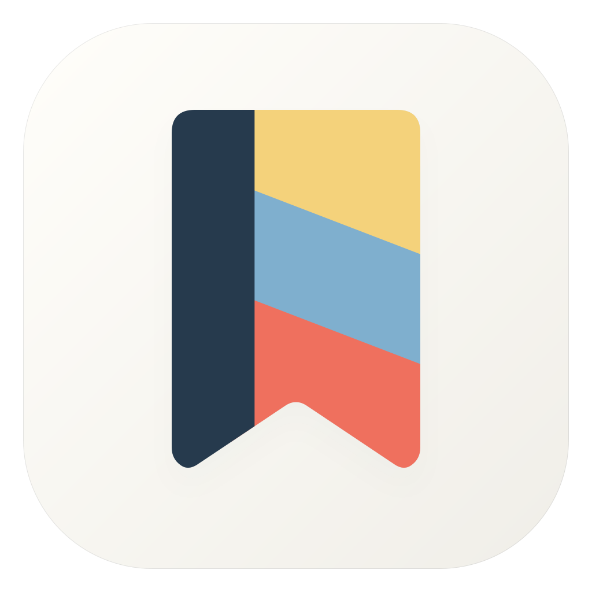
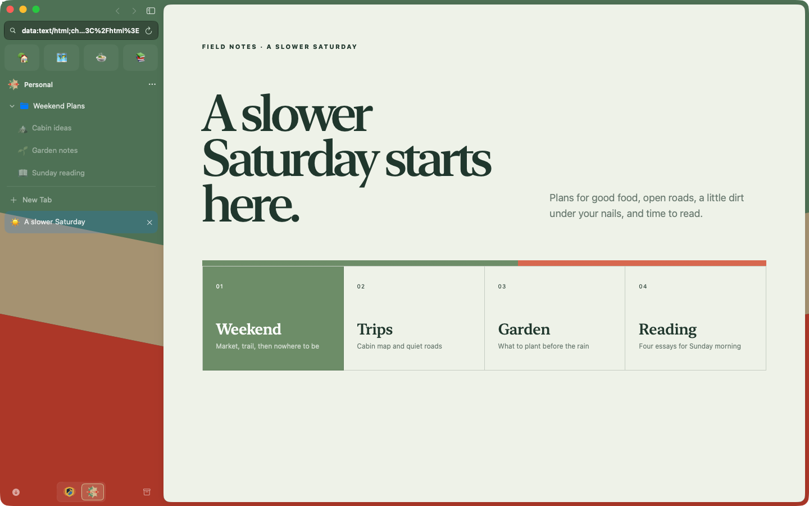
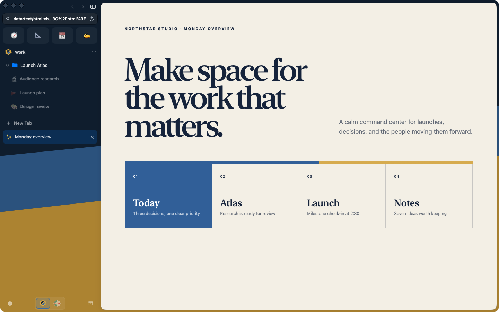
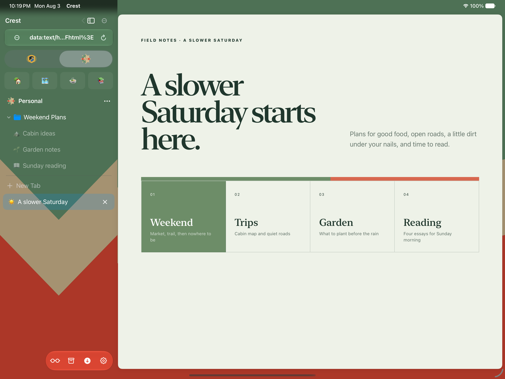
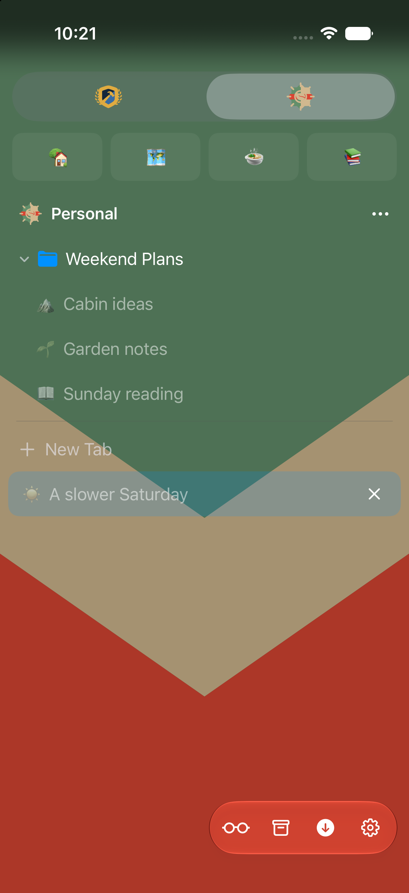

<div align="center">
  
  <h1>Crest</h1>
  <p><strong>An open source browser for Mac, iPhone, and iPad.</strong></p>
  <p>Built with SwiftUI and WebKit, with separate Spaces for different parts of your life.</p>
  <p>
    <a href="https://github.com/pauljoda/Crest/actions/workflows/ci.yml"></a>
    <a href="https://github.com/pauljoda/Crest/releases/latest"></a>
    <a href="LICENSE"></a>
  </p>
  <p>
    <a href="https://crestbrowser.com/"><strong>Visit the product site</strong></a>
    ·
    <a href="https://crestbrowser.com/guides/">Read the guides</a>
    ·
    <a href="https://github.com/pauljoda/Crest/releases/latest">Download for Mac</a>
    ·
    <a href="https://github.com/users/pauljoda/projects/3">Roadmap</a>
    ·
    <a href="https://www.reddit.com/r/CrestBrowser">Community</a>
  </p>
</div>



## A browser with boundaries

Most browsers put every login, tab, and distraction into one long-lived container. Crest begins with **Spaces** instead. Give work, home, research, or a private session its own banner; Crest gives each one its own cookies, website data, history, archive, tabs, credentials, settings, and sync identity.

Switching Spaces changes more than the color of the window. It changes the browsing context.

## What makes Crest different

- **Spaces with real separation** — sessions, cookies, cache, history, tabs, pins, passwords, extensions, and synchronization remain within their Space.
- **A banner for every side of you** — layer color, field, emblem, and trim into a visual identity that makes context recognizable at a glance.
- **Quick Window** — open a focused, transient page with the right Space's signed-in session, then dismiss it without feeding the main tab pile.
- **Peek** — preview a link above the current page and decide whether it deserves a permanent tab.
- **A calmer sidebar** — pinned sites, folders, saved tabs, current tabs, recent tabs, downloads, and archive have distinct jobs.
- **Crest Passwords** — origin-matched credentials live in the Keychain, with device authentication around sensitive access and export.
- **Private Spaces** — non-persistent WebKit storage with no normal history, restoration, or sync trail.
- **Native everywhere** — SwiftUI chrome shaped for macOS, iPad, and iPhone, backed by WebKit rather than a cross-platform shell.
- **Power when it helps** — reader mode, content blocking, downloads, website permissions, authentication challenges, popup handling, recovery, and keyboard customization.
- **Portable by design** — import browser data, export a validated Crest archive, and synchronize durable state through CloudKit.

<p align="center">
  
  
  
</p>

## Built as an Apple-platform app

Crest is written in Swift and SwiftUI. Shared policies and features live in `CrestShared`; each platform owns its actual window, WebKit host, commands, and adaptive presentation.

```text
CrestShared/   Domain, application, infrastructure, features, design system
CrestMac/      macOS app and platform-specific presentation
CrestMobile/   iPhone and iPad app and platform-specific presentation
```

Read [the architecture overview](Documentation/ARCHITECTURE.md) for Space isolation, persistence, credentials, synchronization, and the WebKit boundary.

## Build Crest

Requirements:

- Apple silicon Mac
- Xcode with the macOS 26 and iOS 26 SDKs
- [XcodeGen](https://github.com/yonaskolb/XcodeGen)

```bash
git clone https://github.com/pauljoda/Crest.git
cd Crest
Scripts/bootstrap.sh
open Crest.xcodeproj
```

`project.yml` is the source of truth for targets and build settings. Run `xcodegen generate` after changing source roots, targets, or project configuration.

## Releases and updates

macOS releases are distributed directly through GitHub Releases as signed,
notarized Apple-silicon disk images. Crest uses Sparkle 2 with a native SwiftUI
update interface. Stable and nightly builds share a signed appcast; joining the
nightly channel is an explicit choice in General Settings.

GitHub Actions builds every public release, verifies its Developer ID signature
and notarization, publishes provenance and checksums, then updates the signed
`updates` branch appcast and that channel's release-note cursor together only
after the immutable release assets exist. Public downloads live in GitHub
Releases rather than GitHub Packages. See the [distribution
runbook](Documentation/Distribution.md) for the channel, credential,
publication, and verification contracts.

## Validate a change

```bash
Scripts/validate-identity.sh
Scripts/validate.sh
Scripts/validate-cache-hygiene.sh
```

Behavior changes should begin with a focused regression test, followed by the affected platform suite. Interactive work is exercised in the real app and Simulator as well as through automated gates.

## Project status

Crest is under active development. The current implementation includes the core browsing, Space isolation, native platform chrome, credentials, data portability, synchronization foundations, Quick Window, Peek, and privacy features described above. The [Crest Roadmap project](https://github.com/users/pauljoda/projects/3) is the public release view; approval-gated and physical-device work remains documented in the [roadmap](Documentation/ROADMAP.md).

## Community and support

Use [r/CrestBrowser](https://www.reddit.com/r/CrestBrowser) for questions,
feedback, ideas, and website or extension compatibility discussion. Use
[GitHub Issues](https://github.com/pauljoda/Crest/issues/new/choose) for
reproducible bugs and concrete tracked outcomes. Security concerns belong in a
[private vulnerability report](https://github.com/pauljoda/Crest/security/advisories/new),
never a public post. [SUPPORT.md](SUPPORT.md) explains each route in detail.

Crest is one of several open source projects built by Paul Davis. You can
support the work through [Ko-fi](https://ko-fi.com/pauljoda/tiers) or
[GitHub Sponsors](https://github.com/sponsors/pauljoda). Sponsorship does not
buy roadmap priority or private access.

## Sponsors

Monthly support helps pay for hosting, signing, testing, and development across
Paul's open source projects. Sponsors can be recognized in the public
[sponsor roll](SPONSORS.md) at one of three levels:

- **Sponsor — $25/month:** top placement with an optional approved link.
- **Sustainer — $10/month:** higher placement with an optional approved link.
- **Supporter — $3/month:** name in the public roll.

Recognition is optional. A listing is a thank-you, not an endorsement or a way
to buy roadmap priority, private support, or project ownership. See the
[membership tiers on Ko-fi](https://ko-fi.com/pauljoda/tiers) to become a
monthly sponsor.

## Contributing

See [CONTRIBUTING.md](CONTRIBUTING.md) for setup and change discipline,
[GOVERNANCE.md](GOVERNANCE.md) for project ownership, and the
[documentation index](Documentation/README.md) for engineering references.
Architecture changes should preserve the Space boundary and the native shape
of each platform.

## License and brand

Crest source code is available under the [Mozilla Public License 2.0](LICENSE).
The source is open for inspection, modification, and commercial use under that
license. The Crest name, app icon, logos, and official distribution identity
are reserved; modified distributions must use their own branding as described
in [TRADEMARKS.md](TRADEMARKS.md). Third-party notices are collected in
[THIRD_PARTY_NOTICES.md](THIRD_PARTY_NOTICES.md).
